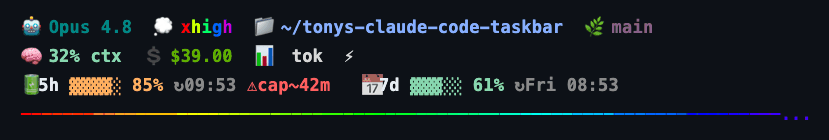

# Tony's Claude Code taskbar

A smart, color-coded status line for [Claude Code](https://claude.com/claude-code) — see your model, thinking effort, context, cost, token burn, and **how close you are to your usage limits** at a glance. Colors and warnings fire automatically as you approach a wall.

Built on [ccstatusline](https://github.com/sirmalloc/ccstatusline) with a small shell colorizer (`cc-health.sh`) that turns the raw status JSON into traffic-light signals — now with a **flowing 24-bit rainbow** rule above your input, and **Sam**, a voice layer that lets you *talk to Claude Code* (Superwhisper dictates in; `sam` speaks the reply back via ElevenLabs).



---

## What you're seeing

**Line 1 — context**
- `🤖 model` you're on, `💭 effort` level **colored by intensity** (low → gray, max → red), current `📁 dir`, `🌿 git branch`.

**Line 2 — this session**
- `🧠 context %` used (green → amber → red), with `⚠compact soon` before Claude Code auto-summarizes.
- `💲 cost`, `📊 total tokens`, `⚡ burn rate` (tokens/sec).

**Line 3 — your limits**
- `🔋 5h block` and `📅 7-day` windows: **% used + bar + reset clock (`↻`)**.
- A burn-rate projection: `ok`, or `⚠cap~25m` when your current pace would hit the limit **before** it resets — the actionable "you're about to run out" signal.

Colors: 🟢 `<70%` · 🟡 `70–89%` · 🔴 `≥90%`.

**Line 4 — the rainbow**
- A full-width **flowing truecolor rainbow rule** whose hue rotates every refresh. Pure colour-rich flair; lower `refreshInterval` to ~3 for visible motion.

---

## 🎙️ Sam — talk to Claude Code

No app, no second window. Sam is a Jarvis *inside* Claude Code:

- **Voice in:** [Superwhisper](https://superwhisper.com) — hit your keybind, speak, it dictates into the Claude Code prompt. Claude gets to work.
- **Voice out (`sam`):** when you want to *hear* the reply, trigger `sam` — it reads Claude's last response aloud via **ElevenLabs** (your key, from the macOS Keychain).

```bash
# once: store your ElevenLabs key
security add-generic-password -s samantha-loop -a elevenlabs -w

sam            # speak Claude's most recent reply
sam "hello"    # speak arbitrary text
```

Trigger `sam` however you like — a shell alias, a global keybind, or `!sam` in the prompt. Key resolves from `$ELEVENLABS_API_KEY` → Keychain. Voice `21m00Tcm4TlvDq8ikWAM` (Rachel) by default; override with `SAM_VOICE_ID`.

---

## How it works

Claude Code pipes a JSON blob (model, context, `rate_limits`, `effort`, cost…) to whatever command you set as your `statusLine`. Here:

1. `ccstatusline` lays out the widgets and computes the fast stuff (token totals, burn rate, block timing from local transcripts).
2. For the parts that need **conditional color + projection**, ccstatusline calls `cc-health.sh` as a `custom-command` widget (`preserveColors: true`). The script reads the same JSON on stdin and prints ANSI-colored segments.

```
Claude Code ──JSON──▶ ccstatusline ──JSON on stdin──▶ cc-health.sh ──ANSI──▶ your terminal
```

`cc-health.sh` has four modes: `effort`, `ctx`, `limits`, and `rainbow` (the flowing truecolor rule above your input).

---

## Install

```bash
npm install -g ccstatusline@2.2.19
git clone https://github.com/mysticalsin/tonys-claude-code-taskbar.git ~/dotfiles
~/dotfiles/install.sh
```

Then add the status line to your `~/.claude/settings.json` (see [`examples/statusLine.json`](examples/statusLine.json)):

```json
{
  "statusLine": { "type": "command", "command": "ccstatusline", "padding": 0, "refreshInterval": 10 }
}
```

`install.sh` symlinks the scripts + ccstatusline config into place (and backs up anything it would overwrite). Requires `jq` and Node.

---

## Files

| Path | What |
|---|---|
| `.claude/bin/cc-health.sh` | Status colorizer — reads status JSON on stdin, prints colored `effort` / `ctx` / `limits` segments |
| `.claude/bin/cc-tokens` | On-demand token/cost report across all projects (wraps [ccusage](https://github.com/ryoppippi/ccusage)) |
| `.claude/bin/sam` | Sam's voice-out — speaks Claude's last reply via ElevenLabs (on demand) |
| `.config/ccstatusline/settings.json` | ccstatusline widget layout (uses `$HOME` paths — portable) |
| `examples/statusLine.json` | The `statusLine` snippet to add to your own settings |

> Personal Claude Code settings (hooks, plugins) are **not** included — only the status-line layer.

---

## Bonus: `cc-tokens`

```bash
cc-tokens                   # token/cost per session+project
cc-tokens daily | monthly   # totals
cc-tokens blocks --active   # current 5h block: time left + projected total + cost
```

---

## Tunables (`cc-health.sh`)

| Knob | Default | Where |
|---|---|---|
| Danger color cutoffs | `70` / `90` | `col()` |
| Compact warning | `≥85%` | `ctx` mode |
| Bar width | `5` | `bar()` |
| Block lengths | `18000`s / `604800`s | `project()` calls |
| 7-day warn horizon | `86400`s (only warn if cap <24h out) | `limits` mode 7d call |

---

## Credits

- [ccstatusline](https://github.com/sirmalloc/ccstatusline) — the status line engine
- [cc-statusline](https://github.com/chongdashu/cc-statusline) — original inspiration
- [ccusage](https://github.com/ryoppippi/ccusage) — usage reporting behind `cc-tokens`

MIT
